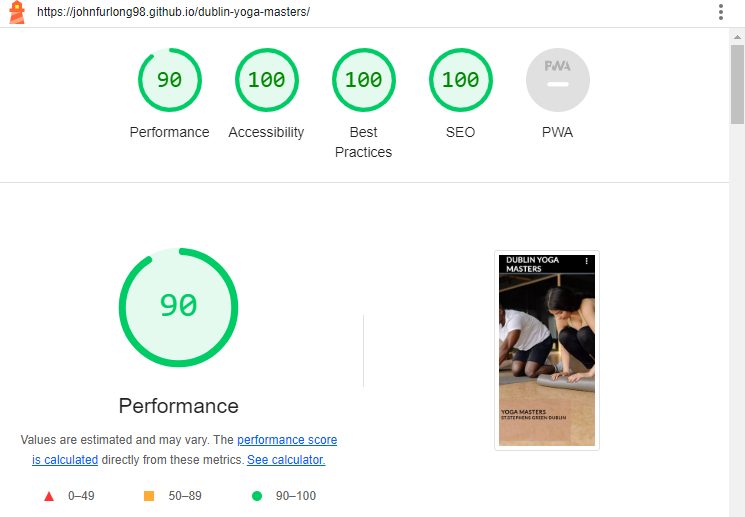

# Dublin Yoga Masters

Welcome to Dublin Yoga Masters, your destination for professional yoga classes and tutorials in Dublin. Our platform is designed to enhance your well-being with expert instructors, offering tailored classes for all levels of experience.

## Features
- **Header**
  - The professional header showcases the Dublin Yoga Masters logo, creating a strong brand presence. The navigation menu provides quick access to essential sections, including Home, About Us, and Contact Us.

- **Navigation Bar**
  - Featured on all pages, the responsive navigation bar ensures seamless navigation. Links to the Home, About Us, and Contact Us pages provide a user-friendly experience.

- **Homepage**
  - The homepage serves as the gateway to Dublin Yoga Masters. It features a hero image, inviting users to explore the world of yoga. The cover text introduces the name of the club and the location.

- **About Us Section**
  - Dive into the essence of Dublin Yoga Masters with the About Us section. Expert instructors offer tailored classes for all levels – from foundational poses for beginners to advanced sequences for seasoned yogis.

- **Contact Us Page**
  - Connect with the Dublin Yoga Masters community through the Contact Us page. Fill out the form to get in touch with our team and start your yoga journey.

- **Social Media Links in Footer**
  - The footer features links to Dublin Yoga Masters' social media platforms, promoting community engagement and connection.

## Testing

-I made sure that the form works, in every field.

-I made sure that all pages are easy to naviagte and that everything is easy to read.

-I made sure that the project is responsive and looks good on standard devices. Including :
   - Ipad Air          820 x 1180
   - Ipad pro         1024 x 1366
   - Ipad              768 x 1024
   - Iphone 6/7/8      375 x 667
   - Iphone 12 pro     390 x 844
   - Iphone 14 pro max 430 x 932
   - Galaxy S8         360 x 740
   - Galaxy S9         320 x 658
   - Blackberry Z30    360 x 640
   - Nest Hub         1024 x 600

### Validator Testing

- HTML
  - I made sure there were no errors were returned when passing through the official W3C validator.
- CSS
  - I made sure there were no errors were found when passing through the official (Jigsaw) validator.
- Accessibility
  - I made sure that the colors and fonts chosen are very easy to read and accesible by running it in lighthouse on devtools
  

### Bugs

- I had a bug with the favicon and was not showing in the browser tab due to wrong file path which was then corrected.

### Deployment 

- The site was deployed to GitHub pages. The steps to deploy are as follows:
  - In the GitHub repository, navigate to the settings tab
  - From the source section drop-down menu, select the Master Brranch
  - Once the Master branch has been selected, the page provided the link to the completed website. 

- The live link is [Dublin Yoga Masters](https://johnfurlong98.github.io/dublin-yoga-masters/).

## Credits

### Content

- The code for the sign up form was taken from the CI [Love Running](https://github.com/johnfurlong98/Love-Running-Walkthrough-Project)Project.
- Text on the About Us page was created by Dublin Yoga Masters.
- Icons in the footer were obtained from [Font Awesome](https://fontawesome.com/).

### Media

- Images used on the platform were sourced from Pexels.
- I used a JPG to WEBP coverter for my background images.(https://www.freeconvert.com/jpg-to-webp)
- I used a compressor to make my background images smaller. (https://tinypng.com/)
- I used a resize image tool to also make my background images smaller. (https://simpleimageresizer.com/)

### Icons 
- For my Favicon I used Favicon generator. (https://favicon.io/favicon-generator/)