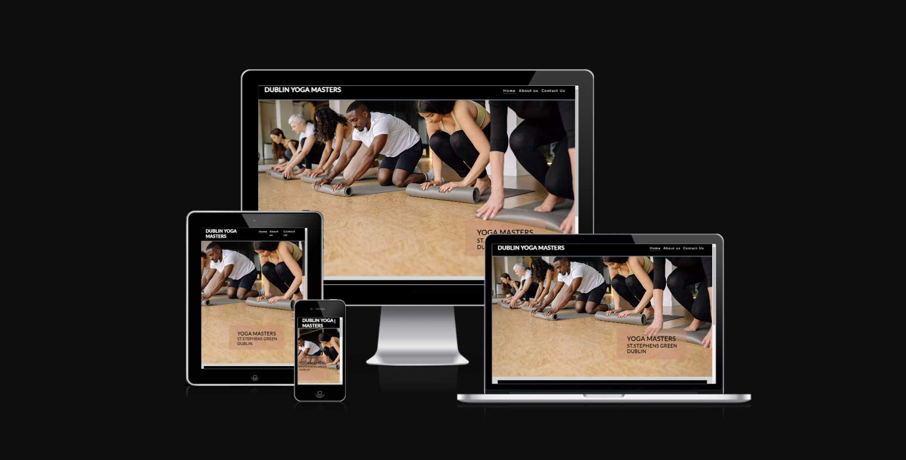
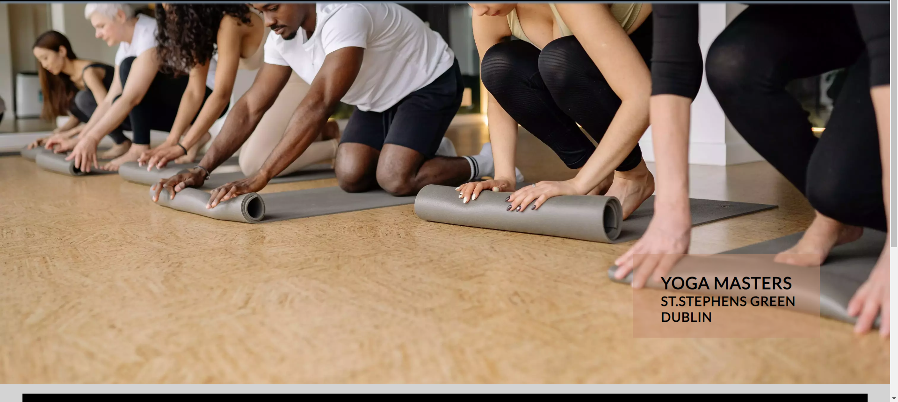
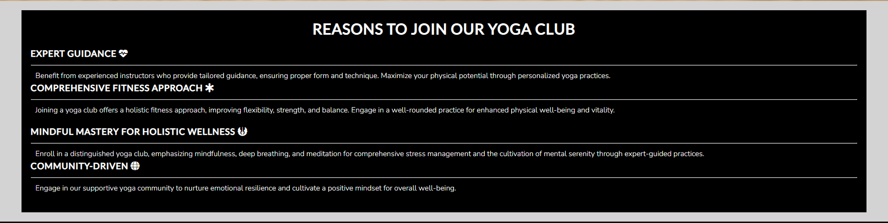
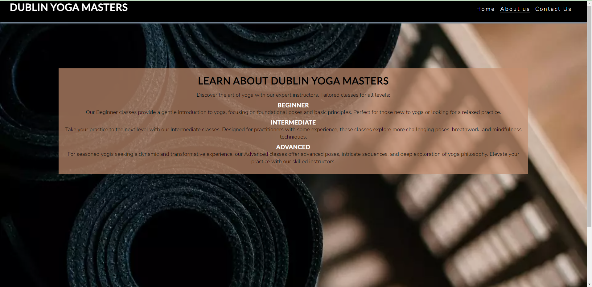
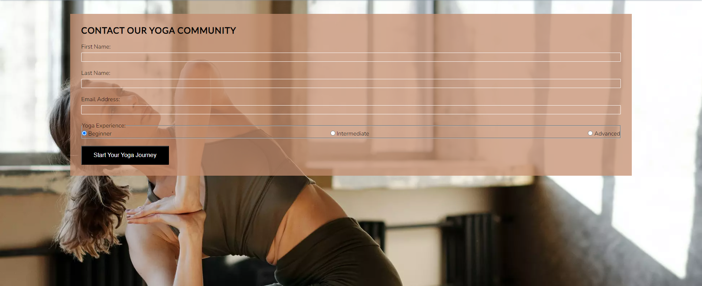

eeeeeeeeeeeeeeeeeeeeeeeeeeeeeeeeeeeeeeeeeeeeeeeeeeeeeeeeeeeeeeeeeeeeeeeeeeeeeeeeeeeeeeeeeeeeeeeeeeeeeeeeeeeeeeeeeeeeeeeeeeeeeeeeeeeeeeeeeeeeeeeeeeeeeeeeeeeeeeeeeeeeeeeeeeeeeeeeeeeeeeeeeeeeeeeeeeeeeeeeeeeeeeeeeeeeeeeeeeeeeeeeeeeeeeeeeeeeeeeeeeeeeeeeeeeeeeeeeeeeeeeeeeeeeeeeeeeeeeeeeeeeeeeeeeeeeeeeeeeeeeeeeeeeeeeeeeeeeeeeeeeeeeeeeeeeeeeeeeeeeeeeeeeeeeeeeeeeeeeeeeeeeeeeeeeeeeeeeeeeeeeeeeeeeeeeeeeeeeeeeeeeeeeeeeeeeeeeeeeeeeeeeeeeeeeeeee# Dublin Yoga Masters

Welcome to Dublin Yoga Masters, your destination for professional yoga classes and tutorials in Dublin. Our platform is designed to enhance your well-being with expert instructors, offering tailored classes for all levels of experience.

## Features
- **Header**
  - The professional header showcases the Dublin Yoga Masters logo, creating a strong brand presence. The navigation menu provides quick access to essential sections, including Home, About Us, and Contact Us.

- **Navigation Bar**
  - Featured on all pages, the responsive navigation bar ensures seamless navigation. Links to the Home, About Us, and Contact Us pages provide a user-friendly experience.

- **Homepage**
  - The homepage serves as the gateway to Dublin Yoga Masters. It features an elegant hero image, inviting users to explore the world of yoga. The cover text introduces the different class levels – Beginner, Intermediate, and Advanced – catering to practitioners at every stage.

- **About Us Section**
  - Dive into the essence of Dublin Yoga Masters with the About Us section. Expert instructors offer tailored classes for all levels – from foundational poses for beginners to advanced sequences for seasoned yogis.

- **Contact Us Page**
  - Connect with the Dublin Yoga Masters community through the Contact Us page. Fill out the form to get in touch with our team and start your yoga journey.

- **Social Media Links in Footer**
  - The footer features links to Dublin Yoga Masters' social media platforms, promoting community engagement and connection.

## Testing

### Validator Testing

- HTML
  - No errors were returned when passing through the official W3C validator.
- CSS
  - No errors were found when passing through the official (Jigsaw) validator.

### Bugs

The live link is [Dublin Yoga Masters]().

## Credits

### Content

- Text on the About Us page was created by Dublin Yoga Masters.
- Icons in the footer were obtained from [Font Awesome](https://fontawesome.com/).

### Media

- Images used on the platform were sourced from open-source sites.

